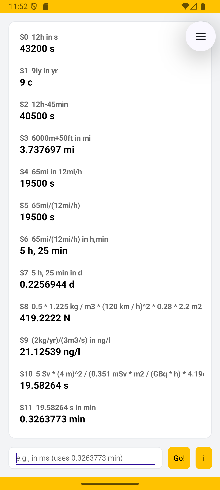
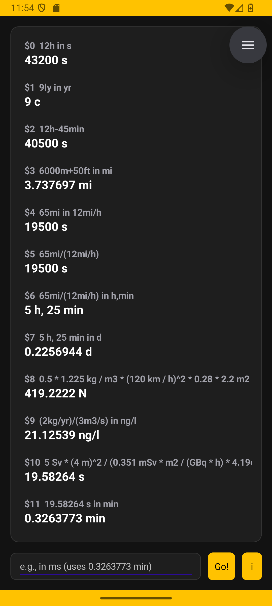

# Umits - a unit converter that is worse than GNU Units, but for android (maui)

(This is not avaliable in the play store yet. I am waiting for my verification)

I got fed up with the GUIs of all unit converters on Android. To convert units you need a keyboard to type the units and a key to press when you want to convert. No clunky UIs. I don't want to go through menus to convert 6ft,2in to m.

So I started writing a unit converter. In the beginning it was a simple linear converter. Then one day someone pointed me to GNU Units and I got nerd-sniped into reading about dimension analysis.  So what can it do?

## Demo

### Syntax

expr in unit:

``` 
12h in s -> 43200s
```

and if we want to travel 9 lightyears in a year we would have to move at:

```
9ly in yr -> 9c
```

You can skip "in unit" and have Umits select a unit for you, but it will not always be great:

```
12h - 45min -> 40440s
```

### what is a dimension? 

In the world of unit conversion and physics, a dimension is the fundamental physical nature of a quantity, regardless of the units used to measure it. 

A good example is length. Meter, inch, furlong and lightyear each describe the same thing. Every one of those units can be described in terms of the other. 

Like in algebra, if we have A² and B, we can multiply them and divide them, but we cannot add or subtract. 15m + 15ft is no problem because they reduce to the same thing.  15m + 10s does not work. 15m/10s however is the same as 5,4km/h. You cannot do 10kg + 10m³, but you can get the density by doing 1kg/m³.

### Adding units of the same dimension

    6000m + 50ft in mi -> 3,737697 mi
    
### Dimension removal

    65mi in 12mi/h -> 19500s
    
oh

    65mi/(12mi/h) in h,min -> 5h 25min

It also saves the previous results as $[nr]. The example above is $2 in our session.

    $2 in d -> 0,2256944 d
    
### Complex queries 

Aerodynamic drag of a car moving at 120km/h

```
 Air Density: 1.225 kg/m^3
 Velocity: 120 km/h
 Drag Coefficient: 0.28
 Frontal Area: 2.2 m^2

 0.5 * 1.225 kg / m3 * (120 km / h)^2 * 0.28 * 2.2 m2 in N -> 419.2222 N
```

Dilution when adding 2kg of a substance per year to a stream of 3m3/s:

```
(2kg/yr)/(3m3/s) in ng/l -> 21.12539ng/l
```

If I have 1kg of Cobolt60, and I stand 4m away, how long until I reach ld50/30 (50 risk of death in 30 days)

```
The ld50/30 dose is 5Sv
Cobalt60 has a decay of 41.9PBq
The gamma constant is 0.351mSv * m2/GBq * h)

5 Sv * (4 m)^2 / (0.351 mSv * m2 / (GBq * h) * 4.19e7 GBq) in s -> 19.58264 s
```
## Shorthand

If you start by writing just "in [unit]" the previous result is inserted at the start. Continued from above:

```
in min -> 0.3263773 min
```

## Supported dimensions

Length (m), mass(kg), time(s), current(A), temperature(K), bits(b) and luminous intensity(cd).

All other units are derived from those. 

## Prefixes

All SI prefixes (?) are supported. The kilometer gets the symbol km. The petameter Pm etc. This means the kilofoot is supported (kft). 

## Powers

Powers are supported, and as such we have support for are and volume. m^2 and m^3 are supported and work like they should. Any unit followed by a whole number is interpreted as a power: ft2 = ft^2

## Derived units

I don't want to write a pretty list. Here is the source code. The m2 and m3 is defined to print better results for when units are not provided

``` f#
("min", "60 s")
("h", "60 min"); ("hr", "1 h")
("d", "24 h"); ("day", "1 d")
("wk", "7 d"); ("week", "1 wk")
("yr", "31557600 s"); ("year", "1 yr") //Julian year!
            
// Length
("in", "0.0254 m")
("ft", "12 in")
("yd", "3 ft")
("mi", "5280 ft")
("nmi", "1852 m")
("au", "149597870700 m")
("ly", "c * 1 yr")
("pc", "3.085677581491367e16 m")

("m2", "m^2")
("m3", "m^3")

// Volume
("l", "0.001 m3")
("gal", "3.78541 l")
("qt", "0.25 gal")
("pt", "0.5 qt")
("fl_oz", "0.0625 pt")

// area
("ha", "10000 m2")
("are", "100m2")
("acre", "4046.8 m2")

("g", "0.001 kg")
("lb", "0.453592 kg")
("oz", "0.0625 lb")
("ton", "1000 kg")
("u", "1.66053906660e-27 kg")
("amu", "1 u")

("N", "kg * m / s^2")
("lbf", "1 lb * gn")
("Pa", "N / m^2")
("bar", "100000 Pa")
("atm", "101325 Pa")
("psi", "lbf / in2")

("J", "N * m")
("W", "J / s")
("Wh", "W * h")
("hp", "745.6998715822702 W")
("cal", "4.184 J")
("BTU", "1055.05585262 J")
("eV", "1.602176634e-19 J")
("C", "A * s")
("V", "W / A")
("ohm", "V / A")
("F", "C / V")
("H", "V * s / A")
("Wb", "V * s")
("tesla", "Wb / m2")
("T_tesla", "1 tesla")

// IT
("B", "8 b")

// Photometry
("sr", "1")          // Steradian (solid angle)
("lm", "cd * sr")    // Lumen (luminous flux)
("lx", "lm / m2")    // Lux (illuminance)

// Constants
("planck", "6.62607015e-34 J * s")
("hbar", "planck / (2 * pi)")

 // Radioactivity
("Sv", "J / kg")
("Gy", "J / kg")
("rem", "0.01 Sv")
("rad_dose", "0.01 Gy")
("Bq", "1 / s")
("Ci", "3.7e10 Bq")
("R", "2.58e-4 C / kg")
 
 // Angles & Rotation (Dimensionless)
("rad", "1")
("deg", "pi / 180")
("rev", "2 * pi")
("rpm", "rev / min")

// Dimensionless ratios
("%", "0.01")
//Parts per ...
("ppm", "1e-6") 
("ppb", "1e-9")
("ppt", "1e-12")

// Molar Masses (Mass of 1 mole of specific substances)
("mol_water", "18.015 g")
("mol_nacl", "58.44 g")
("mol_ethanol", "46.07 g")

// Common Blood Panel Substances
("mol_glucose", "180.156 g")
("mol_cholesterol", "386.654 g")
("mol_triglycerides", "885.43 g")
("mol_urea", "60.056 g")

```

Also supported are degC and degF together with standard gravity (gn), the speed of light (c) and pi (pi).

## logarithmic units (not released yet, have patience)

These are not units per se, but macros. The common way we think about dB is dB sound pressure level (dBSPL), which is defined like this:

```
dBSPL[pressure] = 20 * log10({pressure} / 20uPa)

```

The other dB versions are defined as:

```
// Power (Reference: 1 Watt and 1 milliWatt)
dBW[power] = 10 * log10({power} / 1W) * 1 dB
dBm[power] = 10 * log10({power} / 1mW) * 1dB

// Voltage (Reference: 1 Volt)
dBV[voltage] = 20 * log10({voltage} / 1V) * 1dB
```

Where dB is a dimensionless unit. 

This means we have to treat them specially: we cannot just say 5W in dBW. 

This is true for _all_ logarithmic units, like Niepers, decade, pH and stellar magnitude.

## Screenshot
a light mode



and a dark mode


## Planned features
Entities, like planets (earth.mass, jupiter.radius) or a lot more info on elements or molecules (water.boiling_point, ammonia.thermal_conductivity). The dot syntax is chosen because it is easy to type on a phone keyboard. 

Macros. say we have the macro to add two en entities' masses: massplus[e1, e2] = {e1}.mass + {E2}.mass which expands wrapped in parentheses to not give any nasty surprises. Use like so massplus[earth.mass, jupiter.mass].

User units, entities and macros. the user should be able to define their own things. If I need a lot of info about puff pastry in my calculations I should be able to define that, together with macros to abstract away the tough calculations. 

